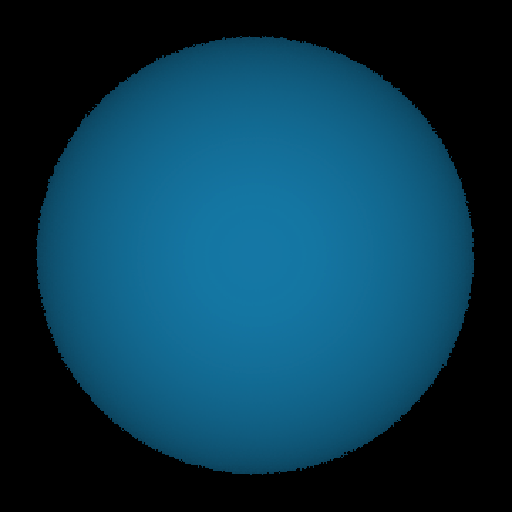
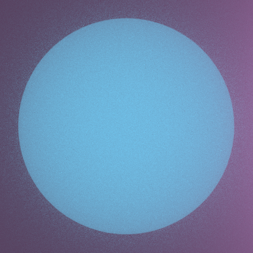
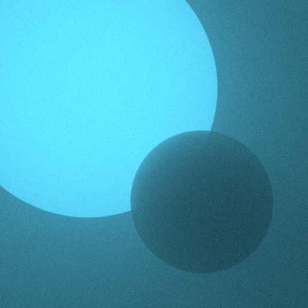

# cse272-project



WebGPU volumetric renderer for CSE 272.

[Live demo](https://sheeptester.github.io/cse272-project/)
(only tested on Chrome 134, Windows 11).
Click on the canvas to lock your pointer, then use Minecraft controls to move around:

- WASD to move
- Space and shift to fly up/down

https://github.com/user-attachments/assets/adc1825e-f848-4c5f-964b-5a713f2a5ea1

## Development

```shell
$ npm install
$ npm run build
$ npm run dev
```

## References

Homework 2 reference code: https://piazza.com/class/m5ke562n9z969v/post/110
GPU PRNG: https://indico.cern.ch/event/93877/contributions/2118070/attachments/1104200/1575343/acat3_revised_final.pdf
